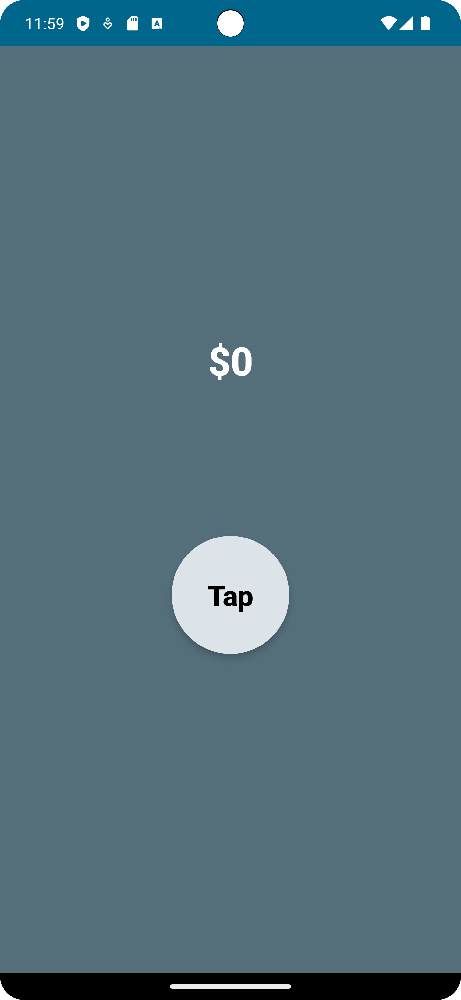
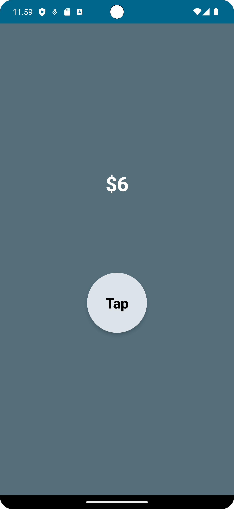
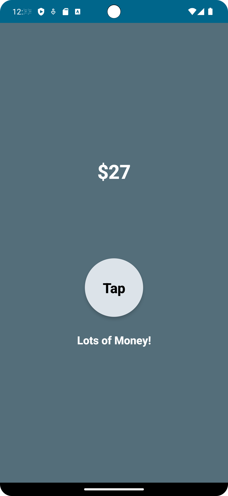

# IntroToCompose: Android Money Counter App

This repository contains an Android money counter application built using Jetpack Compose.  This app is a simple example demonstrating basic Compose features.

## Key Features

* Simple and intuitive user interface built with Jetpack Compose.
* A single button to increment a money counter.
* Displays the current money count.
* Provides a visual cue when the counter exceeds 25.


## Technologies Used

* **Kotlin:** The primary programming language.
* **Jetpack Compose:**  Android's modern toolkit for building native UI.
* **Android SDK (API 34):**  The Android software development kit.
* **Gradle:** The build system.


## Prerequisites

Before you begin, ensure you have the following prerequisites installed:

* **Java Development Kit (JDK) 8 or higher:**  You can download it from [Oracle](https://www.oracle.com/java/technologies/javase-downloads.html) or [AdoptOpenJDK](https://adoptopenjdk.net/).  Ensure the `JAVA_HOME` environment variable is correctly set.
* **Android Studio:**  Download and install the latest version from [the official website](https://developer.android.com/studio).
* **Android SDK Platform-Tools:**  Install the necessary Android SDK build tools within Android Studio.  This includes the Android SDK Platform-Tools package, which is needed for the command-line tools (especially `adb`).


## Installation

1. **Clone the repository:**
   ```bash
   git clone <repository_url>
   ```
2. **Open the project in Android Studio:**  Once cloned, open the project directory in Android Studio.  Android Studio will automatically detect the project and import the necessary Gradle files.
3. **Sync the project:** Android Studio might prompt you to sync the project with Gradle files.  Click "Sync Project with Gradle Files" if prompted.
4. **Install dependencies:** Gradle will automatically download and install all the necessary dependencies listed in the `app/build.gradle.kts` file.  This may take some time depending on your internet connection.


## Project Structure

```
IntroToCompose/
├── app/                 # Android app module
│   ├── src/             # Source code
│   │   ├── main/        # Main source set
│   │   │   ├── java/    # Kotlin source code
│   │   │   │   └── ...
│   │   │   └── ...
│   ├── build.gradle.kts # App-specific Gradle configuration
│   └── ...
├── gradle/              # Gradle wrapper
│   └── wrapper/
│       ├── gradle-wrapper.jar
│       └── gradle-wrapper.properties
├── gradlew              # Gradle wrapper shell script
├── gradlew.bat          # Gradle wrapper batch script
├── settings.gradle.kts   # Gradle settings
├── README.md            # This file
└── ...
```

The `app/` directory contains the Android application code.  The `gradle/` directory holds the Gradle wrapper, which manages the build process.


## Usage Examples

The application is very simple.  Upon launching the application, you will see a circle displaying the text "Tap".  Tapping this circle will increment the money counter displayed above.  A message "Lots of Money!" will appear when the counter exceeds 25.

## Configuration

The application's configuration is primarily handled within the Gradle build files (`build.gradle.kts`, `settings.gradle.kts`, and `gradle.properties`).  You can modify these files (though it's generally not recommended for this simple example) to change aspects such as the minimum SDK version, dependencies, or build settings.  The `gradle.properties` file contains settings such as JVM arguments for the Gradle daemon.

## Build Scripts

* **`gradlew` (or `gradlew.bat` on Windows):** These scripts are wrappers for the Gradle build system.  They allow you to execute Gradle tasks from the command line (e.g., `./gradlew build` to build the application).

## License

### Disclaimer

This repository contains code created while following the course  
**"Android Jetpack Compose - Build Android Native UIs Fast"** by **Paulo Dichone**,  
available at: [O’Reilly Learning Platform](https://learning.oreilly.com/course/android-jetpack-compose/9781803237718/)

The content is intended for educational purposes only and closely follows the structure and lessons from the original course.

All rights to the course content and materials belong to **Paulo Dichone**.  
This repository is not affiliated with or endorsed by Paulo Dichone or O’Reilly.

If you are the content owner and would like this repository modified or removed, please contact me directly.


## Error Messages

Refer to the Android Studio error messages and logs for debugging help.  If you encounter issues, ensure your environment is correctly setup, including Java, Android SDK, and Android Studio.  Check the Gradle sync to confirm all dependencies are correctly resolved.

## Screenshots

<p align="center">

<br>
<em>Figure 1: Home Screen of the app.</em>
</p>

<p align="center">

<br>
<em>Figure 2: Screenshot with Money Count increased.</em>
</p>

<p align="center">

<br>
<em>Figure 3: Screenshot with Money Count increased.</em>
</p>

